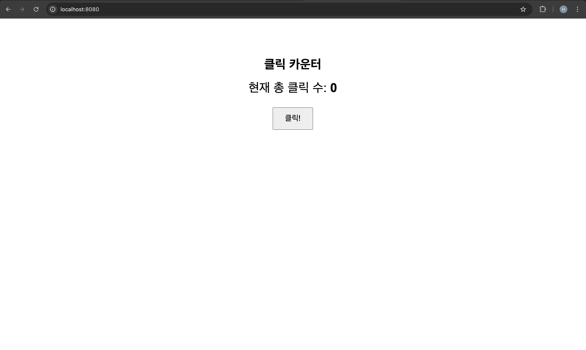
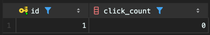

# Click Counter System




클릭 한 번당 카운트를 1 올리는 API가 있습니다.

```http
POST /api/click
```

- 같은 row를 여러 요청이 동시에 갱신하면 카운트 유실이 발생할 수 있습니다.

- 동시성 문제를 재현하고 Step별로 해결 방식을 붙여가면서 결과를 비교하는 튜토리얼입니다.

---

## 단계별 구현 과정

### Step 1. naive

애플리케이션에서 `조회 -> 값 증가 -> 저장`으로 처리하는 가장 단순한 방식입니다.  
구현은 쉽지만 동시 요청이 들어오면 `Lost Update`가 발생합니다.

문서: [step1.md](./result/step1.md)

### Step 2. synchronized

메서드에 `synchronized`를 붙여 JVM 안에서는 한 번에 하나의 스레드만 들어오게 막습니다.  
Step 1보다는 낫지만 트랜잭션과 DB 커밋 경계까지 완전히 보호하지는 못합니다.

문서: [step2.md](./result/step2.md)

### Step 3. DB atomic update

애플리케이션이 값을 읽고 수정하지 않고, DB가 `click_count = click_count + 1`로 직접 증가시킵니다.  
정합성은 확보되지만 모든 요청이 같은 row를 갱신하므로 write hotspot은 남습니다.

문서: [step3.md](./result/step3.md)

### Step 4. Redis atomic increment

실시간 증가 처리는 Redis `INCR`로 받고, 필요할 때 DB로 flush하는 방식입니다.  
DB 단일 row에 직접 쓰는 빈도를 줄여 throughput 개선 방향을 확인하는 단계입니다.

전체 비교: [results.md](./result/results.md)

---

## 각 Step별 엔드포인트

- Step 1: `POST /api/click`
- Step 2: `POST /api/click2`
- Step 3: `POST /api/click3`
- Step 4: `POST /api/click4`
- 현재 count 조회: `GET /api/count`
- Step 4 count 조회: `GET /api/count4`
- Step 4 flush: `POST /api/flush`

---

## 타임리프

API 테스트가 중심이지만, 확인용 화면도 같이있습니다.

- 페이지: `GET /`
- 버튼 클릭: `POST /click`

브라우저에서 [http://localhost:8080](http://localhost:8080) 으로 들어가면 현재 클릭 수와 버튼을 확인할 수 있습니다.  
직접 눌러보는 용도고 동시성 비교는 API와 테스트 코드로 진행합니다.

---

## 실행 전 준비

`src/main/resources/application.yaml` 기준으로 아래 환경이 필요합니다.

- MySQL 실행
- DB 생성: `click_counter`
- 계정: 
- 비밀번호: 

Step4는 로컬 Redis도 실행되어 있어야 합니다.

애플리케이션이 올라오면 JPA가 테이블을 생성하고 `id=1`인 카운터 row도 자동으로 만들어집니다.

---

## 테스트

### JUnit

각 Step마다 병렬 요청 테스트가 따로 있습니다.

- `Step1Test`
- `Step2Test`
- `Step3Test`

전체 실행:

```bash
./gradlew test
```

특정 Step만 실행:

```bash
./gradlew test --tests Step1Test
./gradlew test --tests Step2Test
./gradlew test --tests Step3Test
```

### k6

k6 스크립트도 Step별로 나뉘어 있습니다.

- `k6/click-test.js`
- `k6/click-test2.js`
- `k6/click-test3.js`
- `k6/click-test4.js`

현재 스크립트는 공통으로 아래 조건을 사용합니다.

- 동시 사용자 `100`
- 실행 시간 `10초`

실행 예시:

```bash
k6 run k6/click-test.js
k6 run k6/click-test2.js
k6 run k6/click-test3.js
k6 run k6/click-test4.js
```
---

## 코드 구조

- `Step1CounterController`: Step 1 API와 타임리프 화면 처리
- `Step2CounterController`: Step 2 API 처리
- `Step3CounterController`: Step 3 API 처리
- `Step4CounterController`: Step 4 API와 flush 처리
- `Step1CounterService`: naive 전략
- `Step2CounterService`: synchronized 전략
- `Step3CounterService`: DB atomic update 전략
- `Step4CounterService`: Redis atomic increment 전략
- `CounterRepository`: DB atomic update 쿼리
- `result/`: Step별 분석 문서
- `k6/`: k6 테스트 스크립트